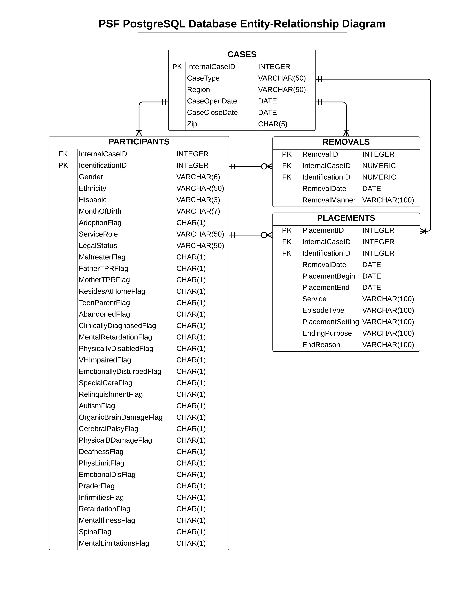

# PSF ERAU Foster Care Project
 PostgreSQL database for PSF data, ingestion, querying, etc.
 
 ## Focus
 The focus of this project now is to ingest the data into a database and use SQL to query
 the records, possibly to create subsets / query for specific ML subsets, then export and
 continue analysis in Python or R.  This is a continuation of the PSF project documented in
 [the FosterCare_Proj repository](https://github.com/mathemacode/FosterCare_Project), with goals
 to make the database and analysis process clean and either confirm existing insights or
 potentially find new ones.  I also want to document this well for future students who want to
 take on this project.
 
 ## TODO
 - [DONE] Ingest into PGAdmin PostgreSQL database
 - [DONE] Queries to validate data
 - Data cleaning with R and then re-ingest?  Plan for this?
 
 ## Initial Plan
 1. [DONE] Check column name consistency, fix if needed
 2. [DONE] Make all participant files same format (including adding empty columns)
 3. [DONE] Merge participants files (pending 2018 fixes - currently missing 2018)
 4. [DONE] Make cases files same format
 5. [DONE] Merge together and add indexes to placements files
 6. [DONE] Merge together and add indexes to removals files
 7. [DONE] Upload all into Postgres DB
 
 ## Entity-Relationship Diagram
 I will be adding a RemovalID and PlacementID to use as Primary Keys to this database design.  I also
 added a "RecordYear" column to the Participants files. I have made this ERD specifically for Postgres 
 implementation.  The structure is otherwise unchanged from how it is provided.
 
