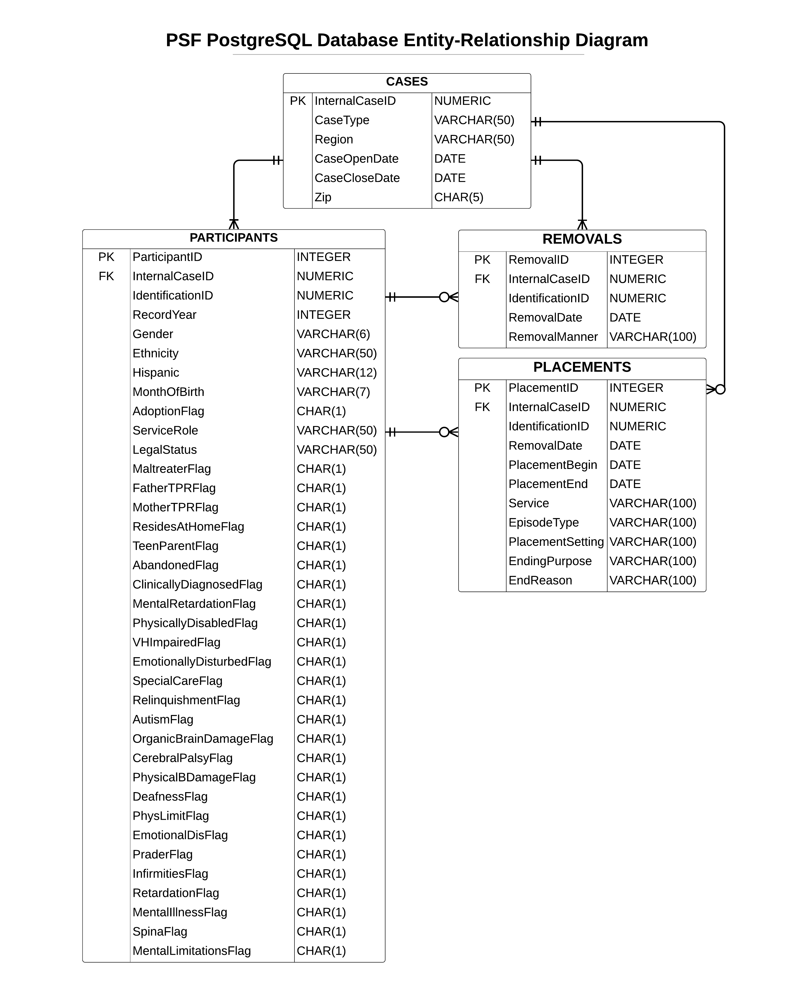

# PSF ERAU Foster Care Project
 PostgreSQL database for PSF data, ingestion, querying, etc.
 
 ## Focus
 The focus of this project now is to ingest the data into a database and use SQL to query
 the records, possibly to create subsets / query for specific ML subsets, then export and
 continue analysis in Python or R.  This is a continuation of the PSF project documented in
 [the FosterCare_Proj repository](https://github.com/mathemacode/FosterCare_Project), with goals
 to make the database and analysis process clean and either confirm existing insights or
 potentially find new ones.  I also want to document this well for future students who want to
 take on this project.
 
 ## Getting Started
 1. Manually check `.xlsx` files, edit yearly files of same type to have same number of columns (even if blank)
 2. Add column (manual or R) to Participants, Removals, and Placements for indexes used as Primary Key
 3. Run `combine_export_cases.R` first, then the other three `combine_export______.R` files
 4. Run `PSF_buildDB.sql` to build the Postgres locally hosted database
 5. Use `PSF_testQueries.sql` to verify imports worked and as a base for beginning querying
 
 If desired, use `df_PK_test.R` to verify that the PK column of a dataframe in R is, in fact, unique, and
 suitable to be used as a PK.  If not, a `duplicates` table is available for debugging.
 
 ## TODO
 - [DONE] Ingest into PGAdmin PostgreSQL database
 - [DONE] Queries to validate data
 - [DONE] Data cleaning with R and then re-ingest - FK to CASE(InternalCaseID) working
 
 ## Initial Plan
 1. [DONE] Check column name consistency, fix if needed
 2. [DONE] Make all participant files same format (including adding empty columns)
 3. [DONE] Merge participants files (pending 2018 fixes - currently missing 2018)
 4. [DONE] Make cases files same format
 5. [DONE] Merge together and add indexes to placements files
 6. [DONE] Merge together and add indexes to removals files
 7. [DONE] Upload all into Postgres DB
 8. [DONE] Remove any InternalCaseID's in Cases that are duplicated -- cascade this change using R to all files
 so that we can use InternalCaseID as a PK on Cases and an FK on all other entities
 
 ## Entity-Relationship Diagram
 I will be adding a ParticipantID, RemovalID and PlacementID to use as Primary Keys to this database design.  
 I also added a "RecordYear" column to the Participants files. I have made this ERD specifically for Postgres 
 implementation.  The structure is otherwise unchanged from how it is provided.  If yearly tables that were
 concatenated together were missing columns that the others had, these were added as blank columns to maintain
 a standard throughout.
 
