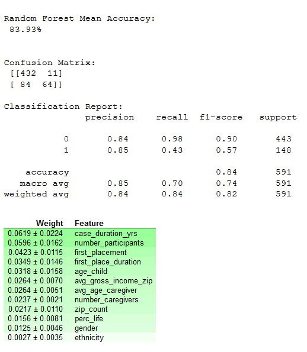
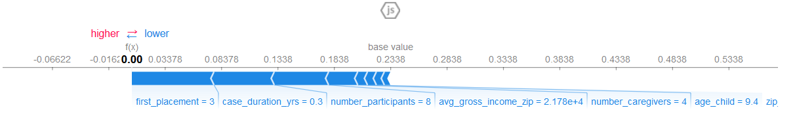

# PSF ERAU Foster Care Project
 More ML modeling of PSF data, and building a PostgreSQL database for PSF data, ingestion, querying, etc.
 
 ## Main idea
 The original focus of continuing this project was to build a SQL database to query
 the records, then to create subsets / tables for specific ML models that could be exported and
 analysis continued in Python or R.  This is a continuation of the PSF project documented in
 [the FosterCare_Proj repository](https://github.com/mathemacode/FosterCare_Project).
 
 However, after working with the data I decided to take a more narrowed approach in building 
 a classification model to predict "circular" cases of more than 1 removal.  This would mean that 
 the child had been removed multiple times, as opposed to cases that simply have a number of 
 placements (foster home to group home and back, or other).  When originally working with the company 
 that provided this data, one of the objectives of the research of data scientists was to predict
 these removals.  In this repo I have redone the ingestion (with new data for 2019), and am working 
 on building accurate classification models that can predict if a child will have more than 1 removal.
 I also want to document this well for future data scientists who want to take on this problem.
 
 ## Update Fall 2020
 There is now an easy way to start building ML models using [this notebook](./Python/ml_modeling.ipynb)), 
 which uses the dataframe output by [this R program](./R/all_numbers_merge_data.R).  **This is not the same 
 file in the original repo despite the name!  It has been heavily modified.**  I also decided to use 
 [2018 IRS data](https://www.irs.gov/statistics/soi-tax-stats-individual-income-tax-statistics-2018-zip-code-data-soi) 
 to add on an `avg_gross_income_zip` as a feature to model.  In the original project work, I did 
 add in some economic information into the models.  This IRS dataset with ZIP code granularity appeared 
 useful for this analysis.

 ## Getting Started
 1. Manually check `.xlsx` files, edit yearly files of same type to have same number of columns (even if blank)
 2. Add column (manual or R) to Participants, Removals, and Placements for indexes used as Primary Key (only relevant for DB)
 3. Run `combine_export_cases.R` first, then the other three `combine_export______.R` files
 4. Run `PSF_buildDB.sql` to build the Postgres locally hosted database
 5. Use `PSF_testQueries.sql` to verify imports worked and as a base for beginning querying
 
 If desired, use `df_PK_test.R` to verify that the PK column of a dataframe in R is, in fact, unique, and
 suitable to be used as a PK.  If not, a `duplicates` table is available for debugging.
 
 ### To get df ready for ML models after the above steps:
 1. Run `all_numbers_merge_data.R`, which outputs the file `ML_frame.csv` into ./data/ml (hidden on this repo)
 2. Open `./Python/ml_modeling.ipynb` for some pre-built models (currently Random Forest & XGBoost)
 
 ## Model Accuracy
 So far I have achieved accuracies above 80% (overall) to classify a child as 0 (no risk of multiple removals), or
 1 (multiple removals expected).  Both the Random Forest and XGBoost can be tuned to achieve 80+%.  There is currently 
 a loop running in the Jupyter Notebook which finds the most accurate parameters for the Random Forest model. 
 Although it takes some additional time to compute, the models make the best possible predictions.
 
 
 
 
 ## SHAP Analysis
 I am also experimenting with SHAP values to visualize feature influences, and might try to build 
 some partial plots as well, but these so far have been fantastic to visualize why the prediction is 
 the way that it is.
 
 An example of a prediction (probability-ized, note this is not an actual pred) leaning to 0:
 
 
 Example of very strong evidence for no further removals:
 
 
 Example of very strong evidence for more than 1 removal:
 
 
 #### Entity-Relationship Diagram
 I will be adding a ParticipantID, RemovalID and PlacementID to use as Primary Keys to this database design.  
 I also added a "RecordYear" column to the Participants files. I have made this ERD specifically for Postgres 
 implementation.  The structure is otherwise unchanged from how it is provided.  If yearly tables that were
 concatenated together were missing columns that the others had, these were added as blank columns to maintain
 a standard throughout.
 
 If time allows I will also add another table to this design for all the engineered features.
 
 
